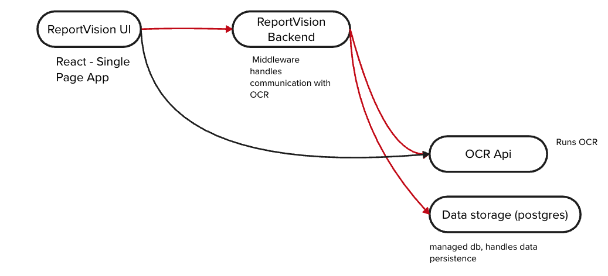

### Overview

ReportVision is a tool that automates the reading and extracting of labs from PDF's

### Steps

1. Annotate Template for a Lab Report
2. Extract Data based on selected annotations
3. Conversion of Extracted Data to PDF's 

### Getting Started

#### Prerequisites

1. [Python3.8](https://www.python.org/downloads/)
2. [Node23.1](https://nodejs.org/en/download)
3. [Tesseract5.5](https://formulae.brew.sh/formula/tesseract) (brew install tesseract)
4. [Java21](https://www.oracle.com/java/technologies/downloads/)
5. [PostgreSQL](https://www.postgresql.org/)
6. [Docker](https://www.docker.com/) (required for DB and middleware set up) 

### Installation and Development Guides

1. For [Frontend](./frontend/README.md)
2. For [Middleware ](./backend/README.md)
3. For OCR [OCR README](./OCR/README.md).

### High Level Architecture

A React-based Single Page Application: This serves as the front-end user interface for the application.

ReportVision Middleware: Acts as middleware to handle communication between the UI, OCR API, and data storage.
Responsible for coordinating requests, processing logic, and integrating with other components.

OCR API: Runs the Optical Character Recognition (OCR) process.
Receives data from the backend, performs OCR on the provided input, and returns the extracted information to the backend.

Data Storage (Postgres):A managed database for data persistence.
Stores data processed by the backend and results generated by the OCR API.
Handles both structured and unstructured data related to the application.

### Infrastructure aod Cloud Components 

The application is hosted in Azure. Please see our infrastructure guide here to learn more

