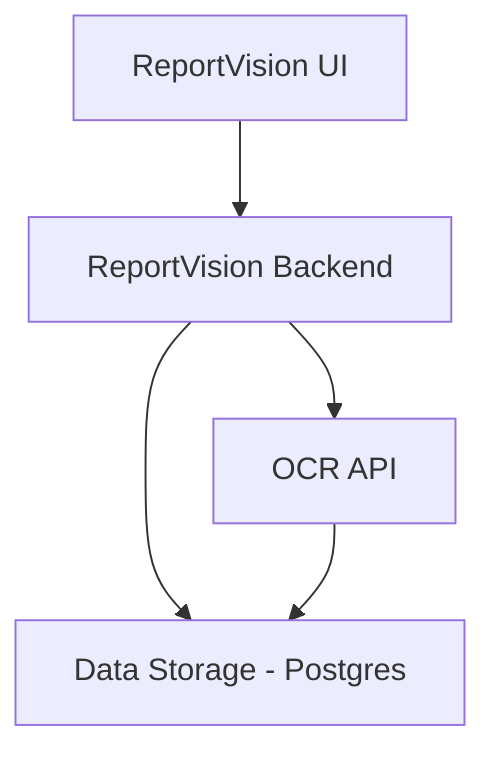

### Overview

ReportVision is a tool that automates the reading and extracting of labs from PDF's

### Steps

1. Annotate Template for a Lab Report
2. Extract Data based on selected annotations
3. Conversion of Extracted Data to PDF's 

### Getting Started

#### Prerequisites

1. [Python 3.8](https://www.python.org/downloads/)
2. [Node 23.1](https://nodejs.org/en/download)
3. [Tesseract 5.5](https://formulae.brew.sh/formula/tesseract) (brew install tesseract)
4. [Java21](https://www.oracle.com/java/technologies/downloads/)
5. [PostgreSQL](https://www.postgresql.org/)
6. [Docker](https://www.docker.com/) (required for DB and middleware set up) 

### Installation and Development Guides

1. For [Frontend](./frontend/README.md)
2. For [Middleware ](./backend/README.md)
3. For OCR [OCR README](./OCR/README.md).

### High Level Architecture

The **ReportVision** application is composed of the following core components:

## Components

### 1. **React-Based Single Page Application (SPA)**
- **Purpose**: Serves as the user interface for the application.

### 2. **ReportVision Middleware**
- **Purpose**: Acts as middleware to handle communication between the UI, OCR API, and data storage.

### 3. **OCR API**
- **Purpose**: Performs Optical Character Recognition (OCR) on provided input.

### 4. **Data Storage (PostgreSQL)**
- **Purpose**: Stores saved templates and extracted data.

## Infrastructure and Cloud Components

### Hosting
- The application is hosted in **Azure**

### Infrastructure Guide
- For detailed information on how the application is deployed and managed in Azure, refer to our [Infrastructure Guide](.github/README.md).

